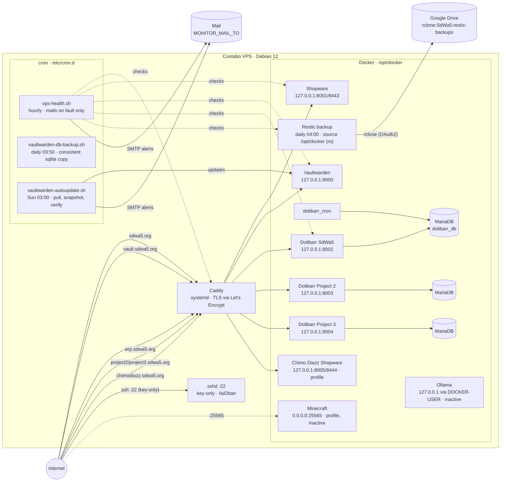

# SdWa5 VPS Infrastructure

Contabo VPS · Debian 12 (bookworm) · all services in `/opt/docker/`

## Overview diagram



Domain → port mapping lives in the [Caddyfile](../Caddyfile); backup detail in
[backup.md](backup.md).

## Stack overview

| Service             | Image                        | Port (internal) | Public URL                 | Compose file                            |
|---------------------|------------------------------|-----------------|----------------------------|-----------------------------------------|
| Shopware            | dockware/shopware:latest     | 8001 / 8443     | https://sdwa5.org          | docker-compose.yml                      |
| Vaultwarden         | vaultwarden/server:latest    | 8000            | https://vault.sdwa5.org    | docker-compose.yml                      |
| Dolibarr SdWa5      | dolibarr/dolibarr:latest     | 8002            | https://erp.sdwa5.org      | docker-compose.yml                      |
| Dolibarr SdWa5 cron | dolibarr/dolibarr:latest     | —               | —                          | docker-compose.yml                      |
| Dolibarr Project 2  | dolibarr/dolibarr:latest     | 8003            | https://project2.sdwa5.org | docker-compose.projects.yml             |
| Dolibarr Project 3  | dolibarr/dolibarr:latest     | 8004            | https://project3.sdwa5.org | docker-compose.projects.yml             |
| Chimo Diazz         | dockware/shopware:6.7.11.1   | 8005 / 8444     | https://chimodiazz.sdwa5.org | docker-compose.projects.yml (profile: chimodiazz) |
| Ollama              | ollama/ollama:latest         | 11434           | (no domain, firewalled)    | docker-compose.yml                      |
| Restic backup       | lobaro/restic-backup-docker  | —               | —                          | docker-compose.yml                      |
| Minecraft           | itzg/minecraft-server:latest | 25565           | —                          | docker-compose.yml (profile: minecraft) |

Cron jobs (host, not Docker) — see [monitoring.md](monitoring.md):

| Job                        | Script                                  | Schedule       |
|----------------------------|-----------------------------------------|----------------|
| Health check               | `monitoring/vps-health.sh`              | hourly, `:17`  |
| Vaultwarden database copy  | `monitoring/vaultwarden-db-backup.sh`   | daily 03:50    |
| Vaultwarden auto-update    | `monitoring/vaultwarden-autoupdate.sh`  | Sunday 03:00   |
| Shopware worker (x2)       | `monitoring/shopware-worker.sh`         | every minute   |
| Chimo Diazz deploy         | `monitoring/chimodiazz-deploy.sh`       | every five minutes |

Reverse proxy: **Caddy** (systemd service, not in Docker) — see [caddy.md](caddy.md)

Host access: **sshd on :22, key-only** since 2026-09-07, with fail2ban. See
[ssh-hardening.md](ssh-hardening.md).

**The host is default-deny on both IP families** since 1.11.0, and this paragraph said the opposite
until 2026-09-13. Measured on the live host on that date: `iptables -P INPUT DROP` and
`ip6tables -P INPUT DROP`, with `22`, `80` and `443` the only accepted inbound ports, fail2ban's jump
at the head of `INPUT`, and `DOCKER-USER` dropping everything arriving from `eth0` toward a container
except `25565`. So a container that publishes on `0.0.0.0` is **not** reachable from outside unless
[`hardening/firewall/sdwa5-firewall.sh`](../hardening/firewall/sdwa5-firewall.sh) names its port, which
is the whole point of that chain.

## Directory layout (`/opt/docker/`)

```
/opt/docker/
├── docker-compose.yml              # main services
├── docker-compose.projects.yml  # Project 2 + Project 3 Dolibarr
├── .env                            # all secrets — NEVER commit
├── .env.example                    # template for .env
├── Caddyfile                       # Caddy reverse proxy config (copy for ref)
├── docker/
│   ├── nginx/                      # empty (unused)
│   └── php/                        # empty (unused)
├── docs/                           # this documentation
├── hardening/                      # host SSH and fail2ban config, deployed to /etc
│   ├── sshd_config.d/10-hardening.conf
│   └── fail2ban/jail.local
├── monitoring/                     # host cron scripts, deployed to /opt/docker/monitoring
├── vaultwarden-db-backup/          # gitignored — consistent sqlite copy for restic
├── shopware-html-data/             # partially tracked — Shopware web root + MySQL
│   ├── composer.json/.lock, symfony.lock, config/*   # tracked
│   ├── custom/plugins/{FroshLazySizes,FroshPlatformFilterSearch,SwagPlatformSecurity,FroshShopmon}/
│   │                                                  # tracked — store-installed, not in composer.lock
│   └── .env, var/, vendor/, public/, files/, config/jwt/   # gitignored (secrets/build/uploads)
├── shopware-mysql-data/            # gitignored
├── shopware-data/                  # gitignored (legacy mount)
├── dolibarr-mariadb-data/          # gitignored — Dolibarr SdWa5 DB
├── chimodiazz-placeholder/         # tracked — maintenance page, not currently routed
├── chimodiazz-src/                 # gitignored — checkout of chimodiazz/website (own deploy key)
├── chimodiazz-html-data/           # gitignored — Chimo Diazz Shopware web root
├── chimodiazz-mysql-data/          # gitignored — Chimo Diazz Shopware DB
├── dolibarr-documents-data/        # gitignored — Dolibarr SdWa5 uploads
├── dolibarr-custom-data/           # gitignored — only GeoLite2-Country.mmdb (MaxMind, re-downloadable)
├── vaultwarden-data/               # gitignored — Vaultwarden data
├── ollama-data/                    # gitignored — Ollama model cache
├── minecraft-data/                 # partially tracked — Minecraft world data
│   ├── server.properties.example, eula.txt, ops.json, whitelist.json, banned-*.json, config/  # tracked
│   ├── server.properties           # gitignored — holds generated secrets, see minecraft.md
│   │   (except config/Discord-Integration.toml — contains the bot token, stays gitignored)
│   └── world/, backup/, mods/, logs/, versions/, libraries/, cache/   # gitignored (data/rebuildable)
└── rclone-config/                  # gitignored — rclone.conf with OAuth tokens
    └── rclone.conf
```

## Memory & swap

5.8 GiB RAM. Two-tier swap: compressed zram first, swapfile as overflow.
Verified live 2026-07-04 (kernel 6.1.0-47-cloud-amd64).

```
NAME       TYPE      SIZE  USED PRIO
/dev/zram0 partition 3,5G 11,8M  100
/swapfile  file        6G 63,6M   -2
```

- **zram** via `zram-tools` package (`zramswap.service`, enabled).
  Config `/etc/default/zramswap`: `ALGO=zstd`, `PERCENT=60` → 3.5G device.
  Priority 100 → kernel swaps here first.
- **Swapfile** `/swapfile` 6G, `/etc/fstab` entry `/swapfile none swap sw 0 0`,
  priority -2 → only used when zram is full.
- **No zswap** — the Debian cloud kernel is built without it
  (`CONFIG_ZSWAP is not set` in `/boot/config-6.1.0-47-cloud-amd64`), so zram
  is the only in-RAM compression option here.
- Sysctls at Debian defaults: `vm.swappiness=60`, `vm.page-cluster=3`.

```bash
# inspect
zramctl
swapon --show
systemctl status zramswap
```

## Common operations

```bash
# start all main services
cd /opt/docker && docker compose up -d

# restart single service
docker compose restart shopware

# view logs
docker compose logs -f shopware

# start project2/project3 services
docker compose -f docker-compose.projects.yml up -d

# reload Caddy config
systemctl reload caddy

# clear Shopware cache
docker exec shopware php bin/console cache:clear
```

## Notes

- Ollama binds `0.0.0.0:11434` and has no auth, **and the firewall is what stops that mattering**.
  `DOCKER-USER` drops anything arriving from `eth0` toward a container unless the port is named there,
  and `11434` is not. Measured 2026-09-13: the container is profile-gated and nothing is listening on
  that port at all. Rebinding to `127.0.0.1:11434` in `docker-compose.yml` would make the container
  safe on its own rather than safe by the chain around it, and it is still worth doing before Ollama is
  ever started again.
- `docker/nginx/` and `docker/php/` dirs exist but are empty — historical artifact from initial setup.
- `shopware-data/` is a legacy volume mount, unused since migration to `shopware-html-data/`.
- Minecraft is fully configured but excluded from default `up` via compose profile `minecraft`;
  `minecraft-data/` persists the world.
- `shopware-html-data/` and `minecraft-data/` are no longer fully gitignored — see the tree above for which
  subpaths are tracked. `frosh/platform-thumbnail-processor` and `frosh/mail-platform-archive` are also
  installed plugins but stay untracked since they're proper `composer.json`/`composer.lock` requires and get
  reproduced by `composer install`.
